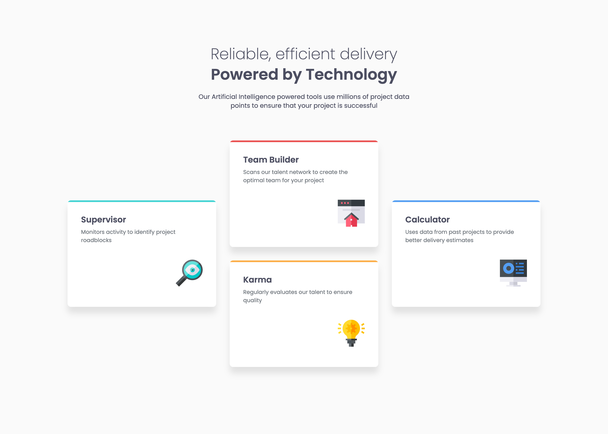

# Frontend Mentor - Four card feature section solution

This is a solution to the [Four card feature section challenge on Frontend Mentor](https://www.frontendmentor.io/challenges/four-card-feature-section-weK1eFYK). Frontend Mentor challenges help you improve your coding skills by building realistic projects.

## Table of contents

- [Overview](#overview)
  - [The challenge](#the-challenge)
  - [Screenshot](#screenshot)
  - [Links](#links)
- [My process](#my-process)
  - [Built with](#built-with)
  - [What I learned](#what-i-learned)
  - [Continued development](#continued-development)
  - [Useful resources](#useful-resources)
- [Author](#author)
- [Acknowledgments](#acknowledgments)

## Overview

### The challenge

Users should be able to:

- View the optimal layout for the site depending on their device's screen size

### Screenshot

### Links

- Solution URL: [GihHub repo](https://github.com/bulhakovolexii/four-card-feature-section/)
- Live Site URL: [GitHub pages](https://bulhakovolexii.github.io/four-card-feature-section/)

## My process

### Built with

- Semantic HTML5 markup
- [Normalize.css](https://necolas.github.io/normalize.css/)
- [Sass](https://sass-lang.com/)
- Flexbox
- CSS Grid
- [Google Fonts](https://fonts.google.com/)

### What I learned

For this project, I decided to challenge myself further by working without a Figma layout.
Despite that, I managed to match the design and extract variables into a separate SCSS file, relying on experience from previous projects. Using a preprocessor was also recommended, though this wasn’t my first time applying one.

What tools do you use to make life easier when a Figma layout isn’t available, or when it lacks a consistent design system?

### Continued development

I underestimated how difficult it is to maintain pixel-perfect design alignment without a Figma mockup — by the end, I honestly felt a bit burnt out, and it’s clear that fatigue affected my code quality. I’ll definitely need to revisit and refactor this project later

### Useful resources

- [Sass installation](https://sass-lang.com/install/) - Here you can find instructions on installing the preprocessor and setting up a project for development.

## Author

- GitHub - [@bulhakovolexii](https://github.com/bulhakovolexii)
- Frontend Mentor - [@bulhakovolexii](https://www.frontendmentor.io/profile/bulhakovolexii)
- LinkedIn - [@bulhakovolexii](https://www.linkedin.com/in/bulhakovolexii/)
